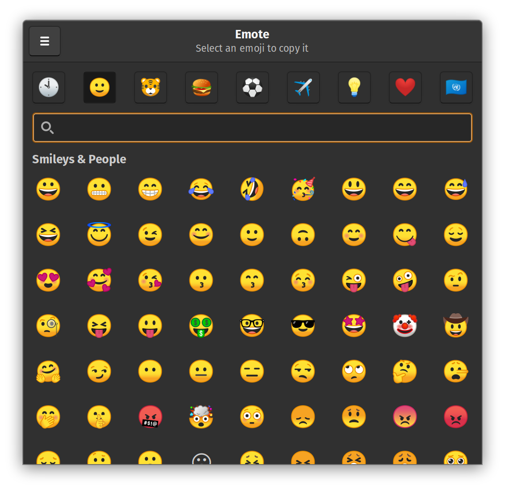

# <span></span> Emote

Emote is a simple GTK3-based Emoji Picker for linux.

Emote runs in the background and, when its keyboard shortcut (`Ctrl+Alt+E`) is presed, an emoji picker window is opened. The selected emoji is copied to the clipboard.

**NOTE - this application is under active development and is not yet ready for public use**



## Guide

### Launching

Emote runs in the background and automatically starts when you log in.

The emoji picker can be opened with either the keyboard shortcut or by clicking the app icon again.

### Usage

Select an emoji to copy it to your clipboard. You can then paste the emoji wherever you need.

You can select multiple emojis by selecting them with right click.

### Keyboard Shortcuts

Open Emoji Picker: `Ctrl+Alt+E` (configurable)

Select Emoji: `Enter`

Add Emoji to Selection: `Shift+Enter`

Focus Search: `Ctrl+F`

Next Emoji Category: `Ctrl+Tab`

Previous Emoji Category: `Ctrl+Shift+Tab`

## Development

### Requirements

Install pipenv:

```bash
sudo pip3 install pipenv
```

Install dependencies:

```bash
pipenv install -d
```

### Running

Run the development version:

```bash
pipenv run start
```

### Debugging GTK3 with GtkInspector

Install GTK3 dev package:

```bash
sudo apt install libgtk-3-dev
```

Enable debug keybinding:

```bash
gsettings set org.gtk.Settings.Debug enable-inspector-keybinding true
```

Launch app in debug mode with interactive inspector:

```bash
GTK_DEBUG=interactive pipenv run start
```

### Packaging

Create a packaged `.snap` file:

```bash
snapcraft
```

## Attribution

### App Icon

Copyright 2020 Twitter, Inc and other contributors

Thanks for the awesome team at Twitter.

https://twemoji.twitter.com
