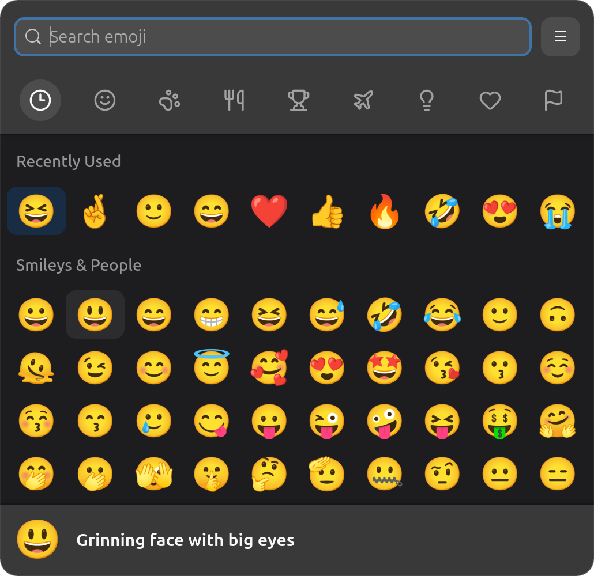

#  Emote

Emote is a popup emoji picker for Linux, built with GTK4 and libadwaita.

> [!IMPORTANT]
> **Call for testers!**
>
> Emote 5.0 is a major update with several big improvements. It needs your help to test it and verify it's ready for release. Please [try the beta and share feedback](https://github.com/tom-james-watson/Emote/issues/199).

<p align="center">
  
</p>

- Start typing to search, or scroll through the emoji categories.
- Quickly find recently used emojis.
- Navigate with your keyboard or mouse, and select one emoji or several.
- Copy emojis to the clipboard and optionally paste them into your previous app.
- Choose your preferred skin tone.
- Emote follows your desktop's theme.

## Installation

### Flatpak (recommended)

<a href="https://flathub.org/apps/com.tomjwatson.Emote"></a>

```bash
flatpak install flathub com.tomjwatson.Emote
```

### Snap

[](https://snapcraft.io/emote)

```bash
sudo snap install emote
```

### Arch Linux

The community maintains an unofficial [AUR package](https://aur.archlinux.org/packages/emote). This is not maintained by me, so install at your own risk.

## Using Emote

Launch Emote from your app menu. The default shortcut to open the picker is `Ctrl+Alt+E`. See [Desktop integration](#desktop-integration) for shortcut setup and login startup.

Start typing to search, or browse the categories. Click an emoji or press `Enter` to copy it and close the picker. If automatic paste is enabled, Emote pastes it into the app you were using. Otherwise, paste it yourself.

To select several emojis, right-click each one or press `Shift+Enter`. Click the final emoji or press `Enter` to finish the selection and close the picker.

Open **Preferences** to change the emoji size or skin tone.

### Keyboard shortcuts

| Action | Shortcut |
| --- | --- |
| Open or close the picker | `Ctrl+Alt+E` (default global shortcut) |
| Select emoji | `Enter` |
| Add emoji to selection | `Shift+Enter` |
| Focus search | `Ctrl+F` |
| Next category | `Ctrl+Tab` |
| Previous category | `Ctrl+Shift+Tab` |
| Close the picker | `Escape` |

You can change the search, category and close shortcuts in the [settings file](#settings-file).

### Settings file

Emote keeps its settings in a JSON file, so you can edit them by hand or manage them alongside your other dotfiles:

- Native installs: `~/.config/Emote/settings.json` (or `$XDG_CONFIG_HOME/Emote/settings.json`)
- Flatpak: `~/.var/app/com.tomjwatson.Emote/config/Emote/settings.json`
- Snap: `~/snap/emote/current/.config/Emote/settings.json`

Emote creates the file with these defaults the first time it starts:

```json
{
  "accelerator": "<Primary><Alt>e",
  "skintone_index": 0,
  "emoji_size": 28,
  "picker_size": [515, 500],
  "x11_auto_paste": true,
  "wayland_auto_paste": null,
  "shown_welcome": false,
  "shortcuts": {
    "focus_search": "<Primary>f",
    "next_category": "<Primary>Tab",
    "previous_category": "<Primary><Shift>Tab",
    "close": "Escape"
  }
}
```

- `accelerator` is the X11 global shortcut in GTK accelerator syntax. Use `""` for none. On Wayland your desktop owns the shortcut.
- `skintone_index` runs from `0` (no skin tone) to `5`.
- `emoji_size` is one of `20`, `24`, `28`, `32` or `36`.
- `wayland_auto_paste` stays `null` until you choose a paste mode during Wayland setup.
- Set `shown_welcome` to `true` to skip the picker that opens on first launch.
- `shortcuts` holds the picker's own shortcuts in GTK accelerator syntax: modifiers such as `<Primary>`, `<Shift>`, `<Alt>` or `<Super>`, then a key name such as `Tab`, `Escape` or `n`. A shortcut without a modifier also fires while you type in the search box. Emote falls back to the default for any shortcut it cannot parse.

Restart Emote after editing the file. Emote only rewrites the keys it changes, so a running Emote won't overwrite your edits. Emote ignores a value of the wrong type and uses the default instead. If the file is not valid JSON, Emote uses the defaults and moves the file to `settings.json.bak` the next time it saves a setting.

## Desktop integration

### Global shortcut

On **X11**, Emote handles the global shortcut itself. Change it from **Keyboard Shortcuts** in Emote.

On **Wayland**, your desktop manages the shortcut through its Global Shortcuts portal. Emote offers to set this up the first time you open the picker. You can skip setup and keep an existing manual shortcut, or set it up later from **Keyboard Shortcuts**. To change or enable a registered shortcut, use your desktop's shortcut settings.

If your desktop does not support the portal, configure a shortcut manually using the [Wayland shortcut guide](https://github.com/tom-james-watson/Emote/wiki/Hotkey-In-Wayland).

### Automatic paste

Automatic paste is optional on both X11 and Wayland. Turn it on or off in **Preferences**. It is on by default on X11.

On **Wayland**, it also needs your desktop's permission to control the keyboard. Emote offers to enable it during setup. On GNOME, allow “Remote Interaction” when prompted. Emote requests keyboard control, not screen access.

If automatic paste is disabled or unavailable, your selection is still copied to the clipboard.

### Login startup

Emote starts automatically when you log in. Launch it once from your app menu after installing.

## Development

[](https://github.com/tom-james-watson/Emote/actions/workflows/build.yml)

See the [development guide](docs/development.md) for running from source, debugging, and testing desktop integration. The [release guide](docs/releasing.md) covers building and publishing Flatpak and Snap packages.

## Credits and license

Emote is licensed under the [GNU GPL v3 or later](LICENSE.md).

Emoji data comes from [OpenMoji](https://openmoji.org/). Category icons include artwork from [Lucide](https://lucide.dev/); see the [bundled icon license](static/icons/LICENSE).
